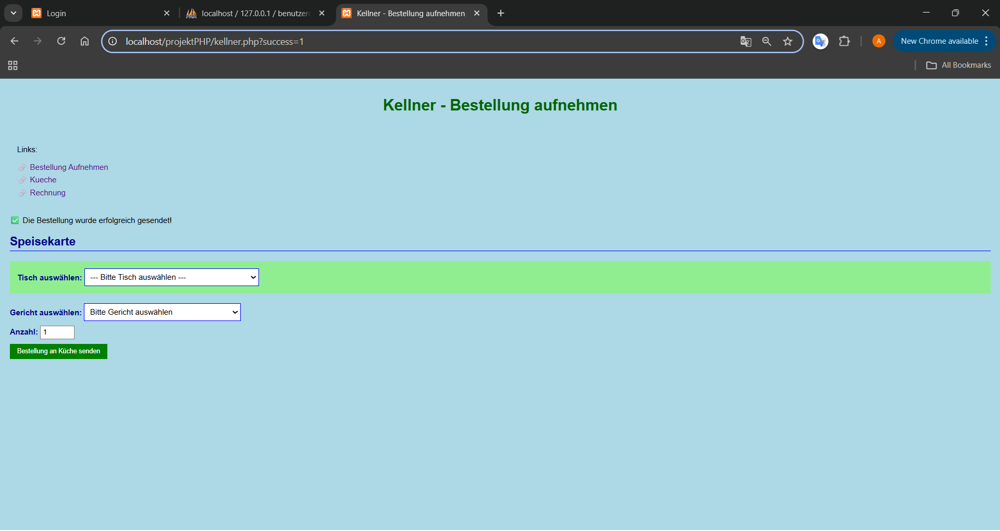
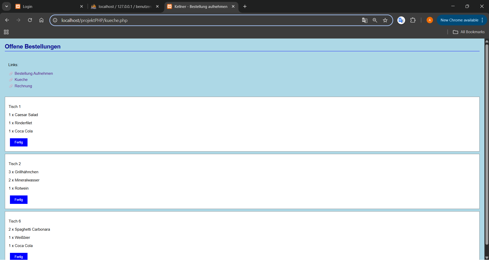
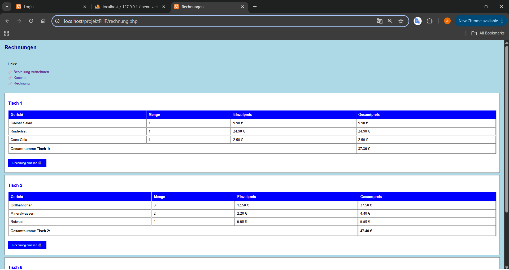

# Restaurant-Bestellsystem

Dieses Projekt ist ein einfaches Restaurant-Bestellsystem mit PHP und MySQL. Es ermöglicht Kellnern das Aufnehmen von Bestellungen, die Weiterleitung an die Küche sowie die automatische Rechnungserstellung.

## Features

- **Bestellungen aufnehmen:** Kellner können Tische auswählen und Gerichte bestellen.
- **Offene Bestellungen verwalten:** Die Küche kann Bestellungen als fertig markieren.
- **Rechnungen erstellen:** Automatische Rechnungserstellung und -verwaltung pro Tisch.
- **Tisch-Verwaltung:** Tischauswahl für freie und belegte Tische.
- **Bestellungen gruppieren:** Mehrere Gerichte werden zu einer Bestellung pro Tisch gruppiert.

## Voraussetzungen

- **Webserver:** z.B. XAMPP
- **PHP:** Version 7.x oder höher
- **MySQL/MariaDB**
- **Browser:** Chrome, Firefox, Edge, Safari

## Installation

1. **Repository kopieren**
   - Lade die Dateien in dein Webserver-Verzeichnis, z.B. `htdocs` bei XAMPP.

2. **Datenbank anlegen**
   - Erstelle eine neue Datenbank mit dem Namen `restaurantdb`.
   - Importiere anschließend die bereitgestellte Datei `restaurantdb.sql` (z.B. mit phpMyAdmin oder über die MySQL-Konsole), um die benötigten Tabellen und Strukturen automatisch anzulegen.

3. **Konfiguration prüfen**
   - Die Zugangsdaten zur Datenbank sind in `config/db.php` hinterlegt:
     ```php
     $servername = "localhost";
     $username = "root";
     $password = "";
     $dbname = "restaurantdb";
     ```
   - Passe sie ggf. an deine Umgebung an.

4. **Projekt starten**
   - Starte in XAMPP sowohl **Apache** als auch **MySQL**.
   - (Optional) Klicke im XAMPP Control Panel auf „Admin" bei MySQL, um phpMyAdmin zu öffnen.
   - Dort kannst du die Datenbank `restaurantdb` verwalten und die Datei `restaurantdb.sql` importieren.
   - Öffne deinen Webbrowser und gib folgende Adresse in die URL-Leiste ein:  
     [http://localhost/projektPHP/kellner.php](http://localhost/projektPHP/kellner.php)

## Nutzung

### Kellner (kellner.php)
- **Tisch auswählen:** Freie Tische oder Tische mit offenen Bestellungen werden angezeigt.
- **Gericht bestellen:** Gericht aus der Liste wählen, Anzahl eingeben und bestellen.
- **Mehrere Gerichte:** Pro Tisch können beliebig viele Gerichte zu einer Bestellung hinzugefügt werden.

### Küche (kueche.php)
- **Offene Bestellungen anzeigen:** Alle Bestellungen mit Status "Offen" werden aufgelistet.
- **Bestellungen fertigstellen:** Auf "Fertig" klicken, um Bestellungen als abgeschlossen zu markieren.

### Rechnungen (rechnung.php)
- **Rechnungsübersicht:** Alle offenen Rechnungen nach Tischen gruppiert anzeigen.
- **Rechnung drucken:** Rechnung als bezahlt markieren und Druckbestätigung erhalten.

## Datenbank-Struktur

Das System verwendet folgende Haupttabellen:

- **tische:** Tischverwaltung mit Tischnummern
- **gerichte:** Speisekarte mit Preisen
- **bestellungen:** Bestellungen pro Tisch mit Status
- **bestellpositionen:** Einzelne Gerichte einer Bestellung
- **rechnungen:** Rechnungseinträge mit Zahlungsstatus

### Vorschau

Kellner-Bereich (`kellner.php`):


Kuechen-Bereich (`kueche.php`):


Rechnungs-Bereich (`rechnung.php`):

